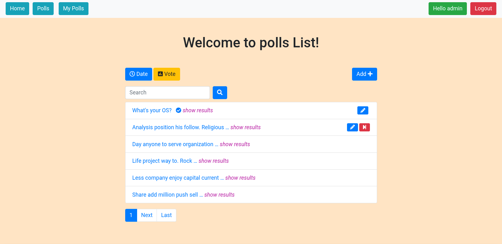
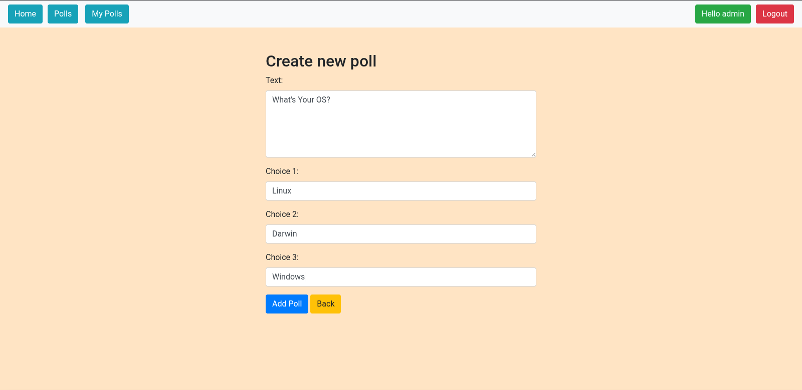
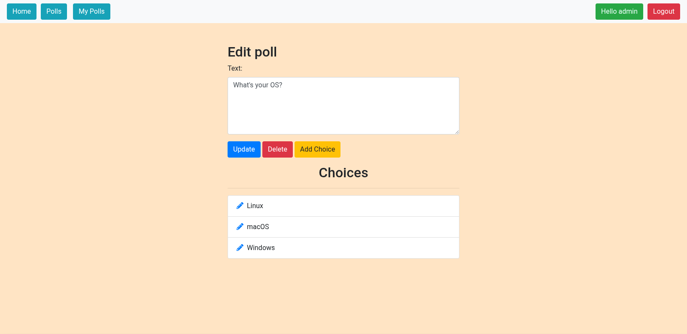

# Poll App with Django

Django Poll App is a straight-forward App for creating and voting Polls
Simple UI and High Functional Poll App.
Try it :)

<h2>Project Snapshots</h2>

  
   

  
   

  
   

 
<h2>Getting Started</h2>
* Download and install Python 3.10 
* Download and install Git.
<h4>Cloning</h4>
<code>git clone https://github.com/ahghanbari/poll_request_app.git</code> 

<h4>Virtual Environment</h4>
<code>cd poll_request_app</code> 
<code>pip install virtualenv</code> 
<code>python3 -m venv .venv</code> 
<code>source .venv/bin/activate</code> 
<code>pip install -r requirements.txt</code> 

<h4>Database Migration</h4>
<code>python manage.py makemigrations</code> 
<code>python manage.py migrate</code>

<h4>For Admin Panel</h4>
<code>python manage.py createsuperuser</code>

<h4> To run the program in local server use the following command </h4>
<code>python manage.py runserver</code>  

Then go to <code>http://127.0.0.1:8000</code> in your browser

<h2>License</h2>

This project is licensed under the MIT License - see the <code>LICENSE</code> file for details.

<h2>Contributing</h2>

For contribution, bug report and feature request please go to <code>https://github.com/ahghanbari/poll_request_app/issues</code>

